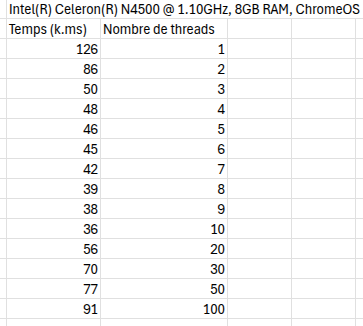

## Réponse aux questions.

1) Cela dépend. En effet, l'utilisation des threads peut-être très utile, cependant si la tâche à réaliser est simple, ne pas diviser en plusieurs threads sera plus efficace et plus rapide. Dans notre cas, la version séquentielle est moins rapide car notre nombre est grand.

2) Plus la valeur de MULTIPLICATEUR est importante, plus l'execution sera lente. La différence est minime car elle se compte en milli-secondes. 

3) Oui, les résustats sont identiques pour les deux versions. Il n'y a pas de race condition car les threads ne modifient pas la même variable et ne touche pas à la zone critique.

4) Voir le fichier resultats.csv

5) Tests effectués : 
    
    - 1 --> 126000 ms
    - 10 --> 36000 ms
    - 100 --> 91000 ms
    - 1000 --> Trop long
    - 10000 --> Trop long
    - 100000 --> Trop long
    - 1000000 --> Trop long

6) Après avoir executé la commande /proc/cpuinfo, je visualise que mon ordinateur possède un processeur de 2 coeurs.

7) Si on initialise 100 threads pour 10 valeurs, il va y avoir un gaspillage de performances car 90 threads n'auront aucune valeur à modifier.

8) Voir image : "Nb threads.png"

Tableau correspondant : 
